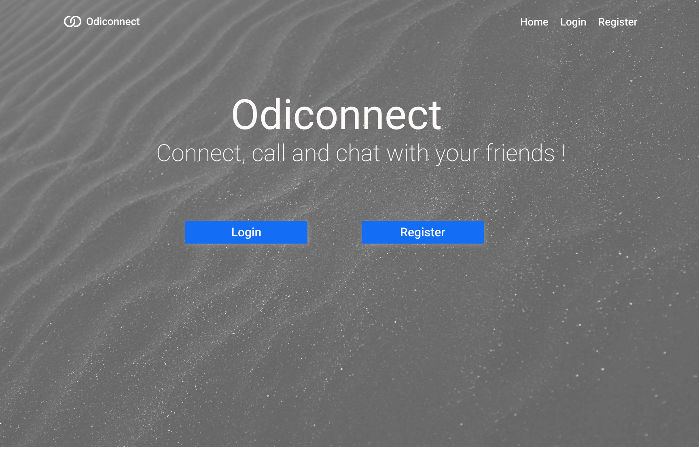
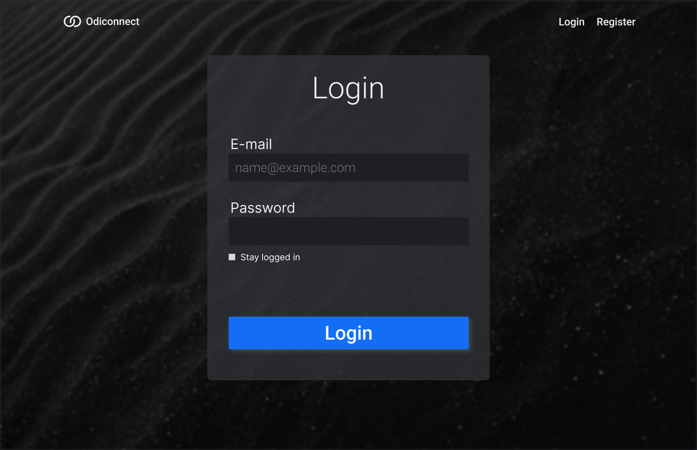
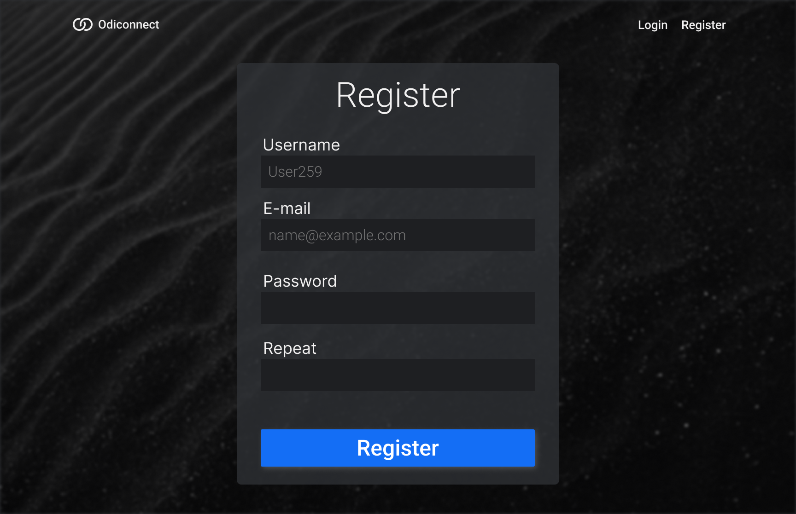
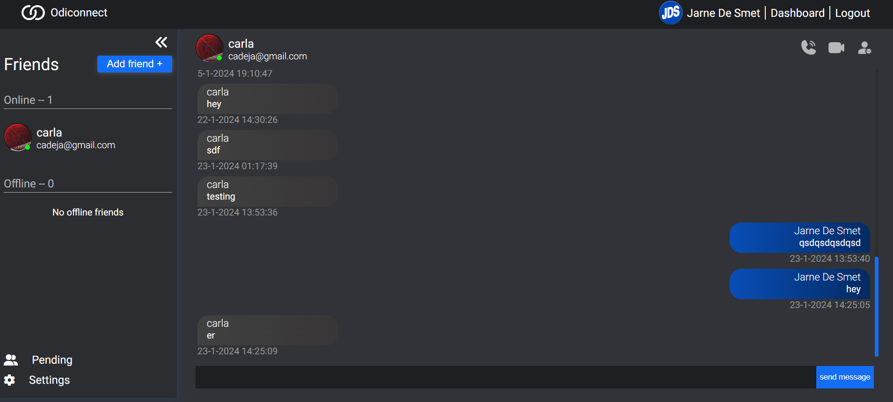
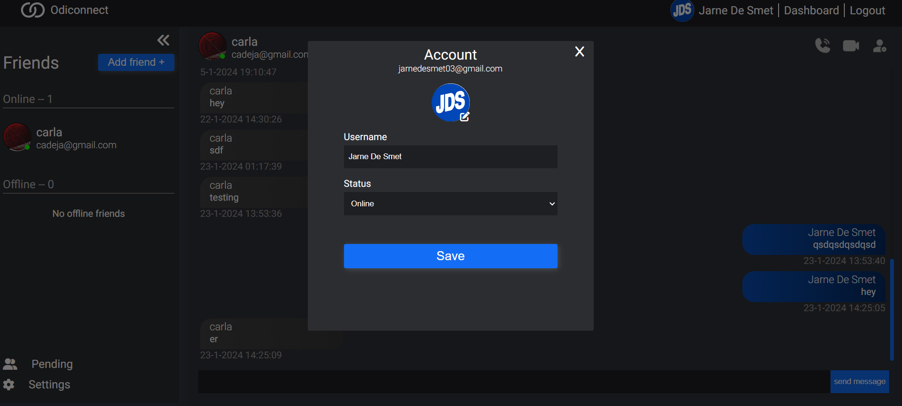
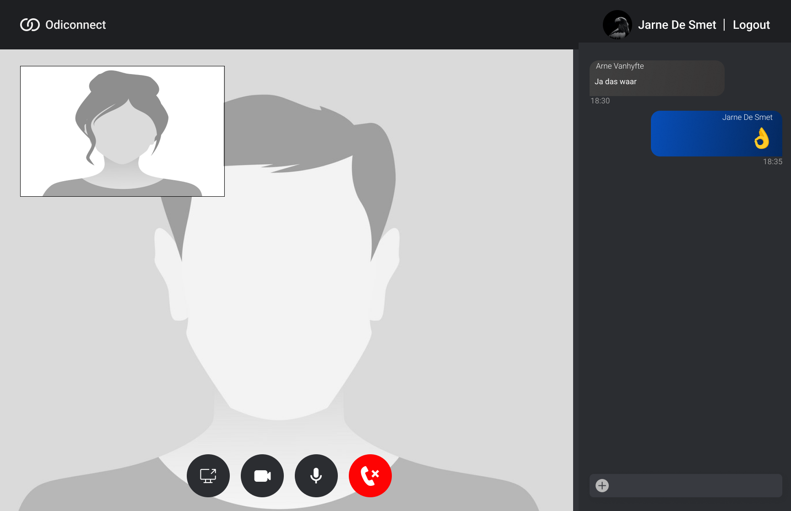

# Odiconnect -> chat and call with friends

## Description

This website uses Vue, webRTC, Typescript, TensorflowJS, Gsap, Firebase and Bun to make it possible to befriend people and chat and call them.
Befriending and authentication is done with Firebase. Gsap is used for animating some parts of the website. webRTC is obviously used to make a peer to peer connection 
with another person. when connected you are able to share your screen, disable your camera and microphone and chat in a call specific chat. TensorflowJS is used to recognize a person's hand. 
when you show a peace sign, thumbs up or the i love you hand sign it will put an emoji in the chat for you to send to the peer. 

Bun is used with websockets to make a singaling server. U can find this project on its own with this link: https://github.com/JarneDeSmet/bun-websocket

you can preview the current site here: https://odiconnect.jarnedesmet.ikdoeict.be/

## Visuals

## Installation and setup

**using npm**

- npm install
- npm run dev

## Usage

**Here you find some links to how to use the libraries I used for this project.**

- WebRTC: https://webrtc.org/ and https://developer.mozilla.org/en-US/docs/Web/API/WebRTC_API
- Vue: https://vuejs.org/guide/introduction.html
- TensorflowJS: https://www.tensorflow.org/js
- Gsap.js: https://greensock.com/gsap/
- Firebase: https://firebase.google.com/docs
- Bun: https://bun.sh/docs
- Bun websockets: https://bun.sh/docs/api/websockets

## Support

If you need help or have a question, email this address: jarne.desmet@student.odisee.be

## Roadmap

- Styling of the call page needs a little work
- Optimizing the speeds of the site -> TensorflowJS slows it down
- Optimizing of the webRTC connection for a more consistent connecting method

## Contributing

I am definitely open for Contributors. Just email me if you are interested.

## License

**This project is licenced with a GNU GPLv3 licence.**

Permissions of this strong copyleft license are conditioned on making available complete source code of licensed works
and modifications, which include larger works using a licensed work, under the same license. Copyright and license
notices must be preserved. Contributors provide an express grant of patent rights.

## Project status

Development will most likely stop after 24/01/2024 since I will have to focus on other school projects.
